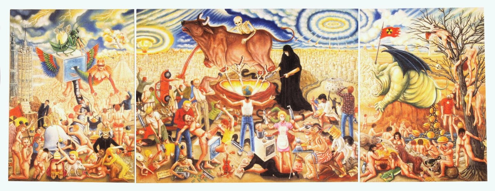

<!--.slide: data-background-image="./Pictures/15.jpg" class="text-bg-clr"-->
# On The Moral Peril Of Exchange
## Jonathan Parry
## (1989)
_in_: Parry, Jonathan and Bloch, Maurice, (eds.) Money and the Morality of Exchange. Cambridge University Press, Cambridge, UK, pp. 64-93.
---
<!--.slide: data-background-image="./Pictures/14.jpg" class="text-bg-clr"-->
## The basic opposition
--
<!--.slide: data-background-image="./Pictures/14.jpg" class="text-bg-clr"-->
## The Gift as the opposite of commodity exchange
Christopher A. Gregory **Gifts and Commodities** (1982) 
---
<!--.slide: data-background-image="./Pictures/14.jpg" class="blur"-->

--
<!--.slide: data-background-image="./Pictures/2.jpg" class="blur"-->

--
<!--.slide: data-background-image="./Pictures/3.jpg" class="blur"-->

--
<!--.slide: data-background-image="./Pictures/4.jpg" class="blur"-->

--
<!--.slide: data-background-image="./Pictures/5.jpg" class="blur"-->

--
<!--.slide: data-background-image="./Pictures/7.jpg" class="blur"-->

--
<!--.slide: data-background-image="./Pictures/8.jpg" class="blur"-->

--
<!--.slide: data-background-image="./Pictures/9.jpg" class="blur"-->

--
<!--.slide: data-background-image="./Pictures/10.jpg" class="blur"-->

--
<!--.slide: data-background-image="./Pictures/12.jpg" class="blur"-->

--
<!--.slide: data-background-image="./Pictures/13.jpg" class="blur"-->

--
<!--.slide: data-background-image="./Pictures/14.jpg" class="blur"-->

--
<!--.slide: data-background-image="./Pictures/15.jpg" class="blur"-->

---
<!--.slide: data-background-image="./Pictures/16.jpg" class="blur"-->

Avaro - Greed(y?)   
Detail from the fresco <i>Last Judgement</i>, by Taddeo di Bartolo.
Collegiate Church of San Gimignano, Siena, Italy, 1394

--
<!--.slide: data-background-image="./Pictures/merchant.png" class="text-bg-bw"-->

---

<!--.slide: data-background-image="./Pictures/kaliYuga.png" class="blur"-->

<blockquote>
Kali Yuga
</blockquote>
---
<!--.slide: data-background-image="./Pictures/jDay.png" class="blur"-->
<blockquote>
conturbat domum suam qui sectatur avaritiam qui autem odit munera vivet   Proverbs 15:27
 
 עֹכֵר בֵּיתוֹ, בּוֹצֵעַ בָּצַע;    וְשׂוֹנֵא מַתָּנֹת יִחְיֶה.
 
משלי טו כז
</blockquote>

