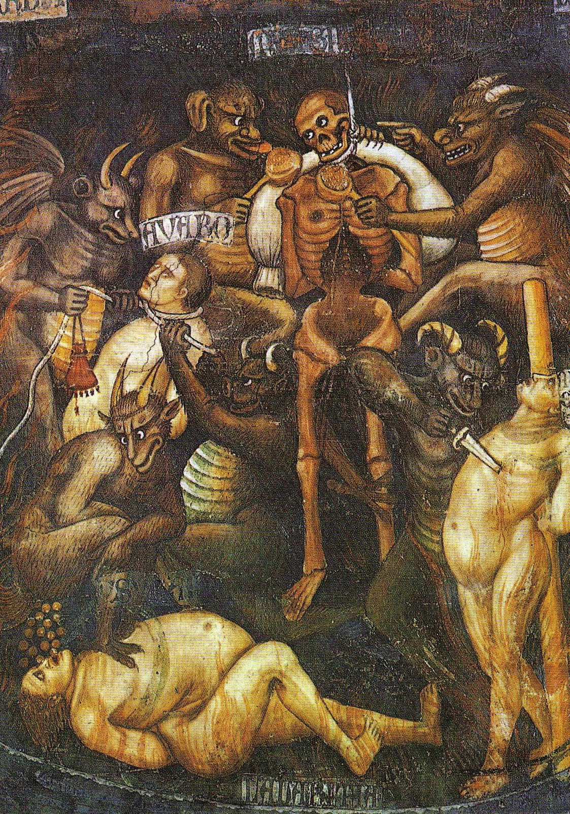
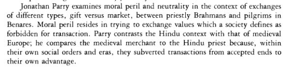

Gift Exchange as diametrically (?) opposed to Commodity Exchange.

(Gregory 1982)

Gift -> Mauss -> interdependence and inalienability
Commodity -> Marx -> reciprocal independence and alienability

equally radical contrast in their moral evaluation.

"Classical" Anthropology:
Example - (Taussig 1980) Christianised Black peasantry of the Cauca valley in Columbia. (note that while the signer of the deed cannot use the money to make a profit, if he is to pass it on to friend, then in their hands the wealth is no longer cursed.)
Capitalist relations of production as the work of the devil, from the pov of a different socio-economic order.
Ex.  - Baptism of money. 'money breeds money' - natural or un/supra-natural
"Commodity relations appear to be a domain of dark and dangerous supernatural forces and a moral peril for those who must engage in them."

This chapter deal with the seemingly opposite: Ethnographic accounts of evil gifts and benvolent commercial exchanges. 
BUT
"This picture must be qualified"
"A dire moral peril attaches only to certain kinds of gifts, while a limited range of commercial exchanges become the focus of a very similar symbolic elaboration."

J. Parry's ethnographic work:
In the pilgrimage city of Benares (Varanasi/Kashi).

The priestly Brahmans who cater to the pilgrims and live on gifts, and constitute a large percent of the city's dwellers.

The _**dana**_

The ideology of the Pure Gift

The full quotient of the merit is held to redound only to the donor who gives without thought for his spiritual harvest.
The merit acquired is proportionate to the giver's means.

The appropriate recipient of the *dana* is a person of supirior status.
Every priestly rite must be accompanied by a *dana* if it is to be of worth.
In north India - wife-taking affines (husbend's of ones daughter or sister, mostly) - are also regualr recipients of the *dana*. The dowry and the virgin. This asymmetry persists with the *dana* flowing unilaterally from wife-givers to wife-receivers.
TERM - Hypergamous
gifts to priests and to affines. 

Priests: "All *dana* is dangerous and all priests are compromised by it", though some are worse than others.

(Cash or kind - *dana* is usually represented as goods but given as cash of symbolic equality to the commodity, but a fraction of the true cost) 

[Search a picture of a warehouse-home of a Panda]

The gift embodies evil and represent a peril, because they are a transmission of the sins of the donor the recipient.
In an ideal world - the priest can 'cleanse' the sins of the object, by rituals and by giving away with increment al that he as taken in *dana*. (Parry uses very visual language of bodily functions, probably based on the emic/etic (?), where the moral filth of the patrons is passed through the sewer - the priest - who can 'digest' the *dana* and 'evacuate' the sin.)
But in the real world, that is regarded as an impossibility. And as a consequanse - he dies a premature and terrible death vomiting excrement and then faces the torments of hell, while his children inherit the sins and his brood dies with a few generations. 

Ex. - The coal-monger and the priest.

Not only spitritual dangers - The sin as a bio-moral phenomenon. It is transferable. it is 'in the money' offered in *dana*. "hot potato" view of Indian social dynamics (Shulman 1985)

Nor are the dangers solely on the recipent's side - the giver must take heed that he is held accountable for the sins the commited with the money he has given, and he thus must give only to a Brahman of unimpeachable charachter.
In view of the grim reality, addmitted by all, where the *dana* is always misused,  [...???...]

[Is the fact that it can not be hoarded or utilised explain this apperant discrapancy? Is this what is meant here?]

מצד אחד - תמיד בשימוש לא טהור. אבל הוא בכל זאת לא יכול לייצר רווח, גם אם איש הדת ינסה. 
It can never be put to productive use.

BUT - While the profits from *dana* cannot be utilised in commerce, commercial profit can can be transmuted into *dana*.
Thus, a perception of piety as 

סוחרים חסודים (?) שמצליחים בשל תרומותיהם לאנשי הדת.

אם כך, האם הכתם נשאר על הכסף, או שאפשר לנקותו, כמו רווחי החוזים השטניים שמתאר טאוסיג? 
If it is passed to them in a different transactional model.

"Some of my evidence would suggest" that money "retains the odour of sin" when moving between different "transactional spheres".

Only in those cases where the exchange is a unilateral one without proper reciprocation that the money of the *dana* transmits its taint when transacted in a different mode. But when a balance is struck, as in the case og the shop-keeper, the sin can safely be assumed to remain with the priest.

The sense of moral peril which the priests exprience in relations to the offerings on which their livelihood depends.
In **ideological** terms, *dana* is a *gift* and *not* a remuneration for priestly services, which are rewarded by a separate emolument known as *daksina*. 

The intended recipient is of the gifts they appropriate is a god, a ghost or an ancestor - thus, the priest can be seen as living parasitically off offerings to others.

(Tawney 1972) - A Cologne merchant on his death bed, advising his sons to persue a less morally perilous occupation than trade. In similar circumstances, the Benares priest cautions his sons against the priesthood, and one can imagine him recommending trade.

All *dana* is dangerous, in religous rites as in marriage. The "*gift of a virgin*", even. 
This is further exampled through the lower-caste notion of spirit possessions - *Bhuta-preta*. The spirits of those who dies a bad death. Among the misfortunes which they bring about, the 'melting' of wealth is a common theme. 
They are most likely to molest members of their own family, but travel between affinally related households, in same path laid out by the *dara* - from wife-givers to wife-receivers. They are said to be 'following the money'.

The *dana* is seen as higly problematic. That is not to say that it is essensially so - in an ideal world, these would be channels of wealth and plenty, funneling the sins outside of society and connecting the families and communities. But in our current epoch, the *Kali Yuga*, there is no such thing as a disinterested donor or truly worthy recipients..

Not the only type of gift, mind you. It gets a bit complicated, but it leads to the question - what is it about the *dana* that makes it a vessel of sin?

One view would be to see it in terms of the ambiguous position of the priest in relation to a Brahmanical ideal moulded by the values of ascetecism. 
It is the Brahamin's ascetic transcendence of the world which qualifies him as a 'worthy vessel' for the gifts of the pious, but it is that same acceptance of these gifts which endangers this very transcendence. 
But how does this explain the in-laws *dana*'s affinity to moral taint?

Another way to approach the problem would be to focus on the **bio-moral** nature of the *dana*, which embodies the somatic and the spiritual of the donor, in a way that other forms of gifts do not. This is consistent with its ideological roots in <u>sacrifice</u>. *Dana* is said to be a surrogate of sacrifice for our degenerate age. 
This can be seen in the case of the *tula dana* - the weight donation - where the donor gives his 'gross mass' (Blood, marrow and excrement included!) equivilant in commodities. 
So, even when the *dana* is only the weight of the donor sins, and his excrement left to himself for now, the principle remains - acceptance of the *dana* entails some for of incorperation of the donor into the self. In a hierarchical world, where beings of different strata are seen as different species, such transfer is bound to be problematic and even subversive of the hierarchy itself. 

(Sudden shift?)

The idea that the gift can be a carrier of sin, removing it from one and transmitting it to another, not only goes against the ideal of disinterested giving, but also presupposes that ritual, and even financial, reparation can be made for moral transgressions. 
Such attempts to dispose of ethical burdens by ritaulistic means are a central preoccupation of Hindu religiosity. 
Certainly the **ethic of intention** completly subverts the notion that atonement can be purchased

It then be possible to to interpret these beliefs about the mystical dangers of *dana* as part of the inevitable backlash against offering ritual solutions to moral problems. 

Further complicating the issue is the belief that all those who die - or, according to some, are cremated - in The City of Temples, attain salvation (in the form of liberation from the cycle of rebirth). While the local priesthood has a clear interest in maintaining this dogma, it also casts their priestly roles and rites in question. If salvation is granted to all, why would the priests and their rituals be needed? 
Not to mentions the ideology of *bhakti*, which has excersised a profound influence on modern Hindusim and according to which a devotion to a personal god is sufficient for salvation. In this context, the uneasiness of the priesthood towards the institute of *dana* makes sense. 

And yet, according to Parry, **the** most problematic aspect of the *dana* concerns the fact that it is an <u>unreciprocated gift</u>. 

When you give more then you receive, then that is auspicious. But any less, then there will be a continual decline.
But in the real world, the professional priest is constrained to retain most of what he receives.
While one might argue that the gift's return is the liberation from sin - that line is faulty on two accounts:

   	1. A *dana* given with for the purpose of redemption cannot, by definition, be a 'true gift'. 
   	2. The Brahmans of today are so fallen and unworthy that entiwining one's moral balance with one of them is a sure-fire way to achieve perdition, not atonement. 

[p.76]

---

Questions:

Cash or Kind - Kind? And can cash not be a gift?

What about competing accounts/ideologies inside the the field? Again, it is a general ethnographic issue, but nevertheless.

---

Avaro - (Greedy?) 
Detail from the fresco **Last Judgement**, by Taddeo di Bartolo.
Collegiate Church of San Gimignano, Siena, Italy
First quarter of the 15th century or 1394 (?)

Dan(a) - दान
Gua-daan - गाय-दान - Cow Donation
Dana - दाना - Grain!

Tula Dan - तुला दान - Weight gift

Bhoot-pret - भूत-प्रेत - Ghost

